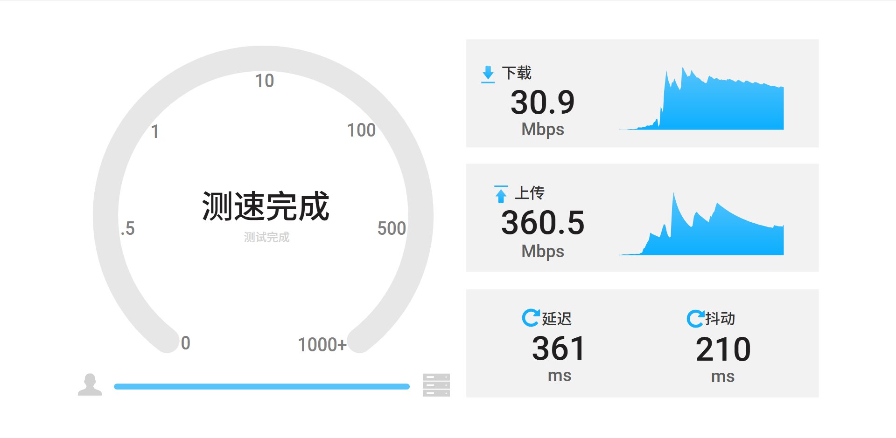

# 网络测速工具 - 中文自托管版

基于 OpenSpeedTest 的**纯中文、无推广、无跳转**自托管测速页面

## 截图预览

（你可以稍后上传测速界面截图到仓库的 images 文件夹，然后在这里插入）

## 主要优化

- 界面、按钮、状态提示全部汉化
- 彻底移除所有 openspeedtest.com 链接、Donate 捐助提示
- 测速完成后结果页干净，不会跳转到任何外部网站
- 支持暗黑/亮色模式自动切换
- 保留原版所有高级功能（多线程、自定义时长、服务器选择等）

## 特别鸣谢

这个中文版在修改过程中得到了 **Grok（xAI 构建）** 的极大帮助！  
Grok 提供了完整的代码分析、汉化建议、跳转清理方案以及最终可部署的修改版本，让这个项目得以快速完成中文本地化。非常感谢！

## 快速部署

1. Fork 本仓库 或 下载 ZIP
2. 登录 Cloudflare → Pages → 创建项目 → 连接 GitHub → 选择本仓库
3. 部署完成后访问你的自定义域名（如 https://你的域名/Speed2/）

其他平台（Vercel / Netlify）同样支持一键部署纯静态站点。

## URL 参数（可选）

- `?test=download` 只测下载
- `?test=upload` 只测上传
- `?test=ping` 只测延迟
- `?run=5` 5秒后自动开始测速

## 许可

MIT License  
原项目：https://github.com/openspeedtest/Speed-Test

欢迎 Star、Fork、使用或反馈！

有问题请在 Issues 中留言～
